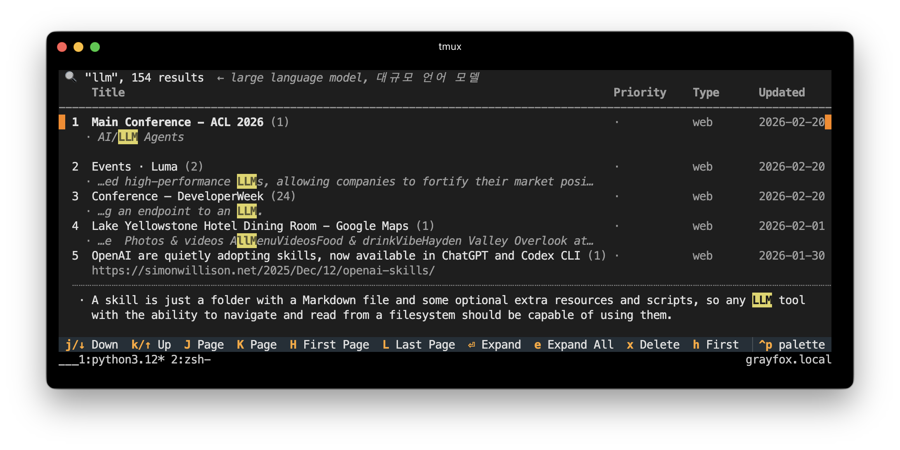

# Lumos

Personal knowledge capture tool. Bookmark in Chrome. Search in Terminal.



## CLI

### Setup

```bash
# Install
git clone https://github.com/e9t/vibe-lumos.git
cd vibe-lumos
pip install -e .

# Initialize
lumos-init --data-dir /some/directory   # use a custom data directory
```

### Config

Config lives at `~/.config/lumos.json`. Override the data dir with `LUMOS_DATA_DIR`.

```json
{
  "data_dir": "~/.lumos",
  "cache": { "formats": ["mhtml", "readable"] },
  "models": {
    "ocr": { "enabled": true, "provider": "upstage", "api_key_env": "UPSTAGE_API_KEY" },
    "llm": { "model": "solar-pro4", "api_key_env": "UPSTAGE_API_KEY" }
  },
  "list": { "default_limit": 10 },
  "theme": { "highlight_color": "yellow", "selection_color": "yellow" },
  "suggest": { "enabled": true, "color": "#FFF9C4", "ratio": 0.06 }
}
```

### Usage

```bash
lumos                           # open interactive TUI
lumos "query terms"             # search and open TUI
lumos --sort priority:desc      # sort by priority
lumos --type kindle             # filter by source
lumos --begin 7d                # last 7 days
lumos --match exact "phrase"    # exact match (default: smart/LLM-expanded)
```

### Import external data

```bash
lumos-import diigo export.jsonl         # import Diigo bookmarks/highlights from https://mm-diigo-rescue-285.netlify.app 
lumos-import kindle "My Clippings.txt"  # import Kindle highlights
```

## Chrome Extension

### Setup

Load `extension/` as an unpacked extension in Chrome. Then register it:

```bash
lumos-init --extension-id <ID>
```

### Usage

- **Text highlights** — select text, click the toolbar to save
- **Image capture** — right-click an image, "Save to Lumos" (with async OCR via Upstage)
- **Page save** — `Cmd+D` / `Ctrl+D` to bookmark + cache (MHTML + Readability)
- **Highlight restoration** — revisit a page and see your highlights restored
- **Suggested highlights** — open an article and the phrases you'd probably
  highlight are marked in pale yellow. They're read-only hints: highlight what
  you want yourself, the usual way. Phrases are what the page is *about* — its
  claims, not your taste — verified to be verbatim page text, and cached per URL
  so a page is only ever analysed once. Toggle with ✨ in the popup, or turn
  it off entirely in config.

  Requires `UPSTAGE_API_KEY` in `~/.env` — Chrome starts the native host with no
  shell environment, so an `export` in `.zshrc` is not visible to it.

  제안 분량은 정해진 개수가 아니라 **본문 대비 비율**로 정해집니다. `ratio: 0.06`이면
  짧은 글이든 긴 글이든 본문의 6% 정도가 표시되어 밀도가 일정합니다. 이 값은 상한일 뿐,
  밑줄 그을 만한 게 없는 구간은 모델이 건너뜁니다 — 링크 목록뿐인 페이지는 거의 비어
  있고, 같은 길이의 에세이는 끝까지 채워집니다 (실측: 8천자 → 2~3개, 5만자 → 19개).

```json
"suggest": {
  "enabled": true,
  "color": "#FFF9C4",
  "ratio": 0.06,        // 본문의 몇 %를 표시할지 (상한)
  "phrase_chars": 150,  // 구절 1개의 평균 길이 (개수 환산용)
  "min_phrases": 1,
  "max_phrases": 80,    // 폭주 방지용 안전장치 (목표치 아님)
  "min_chars": 800,     // 이보다 짧은 페이지는 건너뜀
  "max_chars": 12000,   // LLM 호출 1회당 읽는 분량
  "max_calls": 6        // 긴 글은 병렬 호출로 나눠 끝까지 읽음
}
```

## License

MIT
